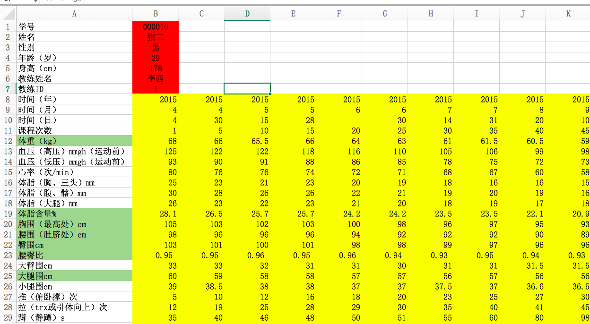
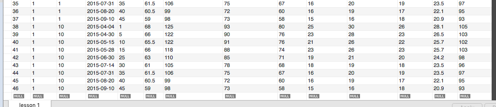

---- 在这里专门记录进程的信息


### 2016 08 26
- Luo
	1. ~~`pip install xlrd` 欠缺在 README.md 说明里~~
	2. ~~(img) error 的网址~~
	3. ~~选择多个文件时，所选择文件内容的显示~~
	4. 想修改已选文件时，会将原来所选文件清空

### 2016 08 27
- Luo <br>
	1. ~~`.gitignore`内容添加问题。能否详细说明一下添加那几行的意义。~~
	
		---
			```
			<<<<<<< HEAD
			database_design/rou.sql
			Dpdb.py
			=======
			>>>>>>> Angryrou/master
			```
		
	2. ~~**导入问题。**我觉得逻辑应该是这样的：如果一个文件有一列信息缺失或输入内容错误（比如说日期缺失等原因导致该条目），结果应该是整个.xlsx或.xls文件导入失败，给用户提示**`XXX.xlsx 的错误原因（例如文件输入格式有误或其它）`**之类的信息，并且该xlsx里的所有内容都不应该导入数据库（就是我之前说的关闭autocommit，系统默认应该是开启的）。<br>
	而不是像现在这样显示`上传成功`。~~

		---
		例子：<br>
		我在Demo中添加了一个新的名为 `模拟数据-张三（李四教练）副本.xlsx` 的 xlsx文件，将其中学员的学号改为了`10`，将其第20次课程那一列的时间（日）信息改成了空。在网页操作是显示了操作成功。并且数据库中可以看到除了20次课程外另外的所有信息内容。内容见下图：
			---
			模拟数据-张三（李四教练）副本.xlsx 内容：
			
			点击上传后的网页信息：
			
			点击上传后的数据库信息：
			

### 2016 08 30
- Luo
	1. 添加 **根据`教练id-学生id`的所有lesson条目的查询模块**
	2. 添加 **根据`教练id-学生id-时间`的删除模块**

- Lyu 
	1. ~~添加横轴 时间信息，并与次数信息完成切换~~
	2. ~~调整界面展现与比例~~

### 2016 09 01
- Luo
	1. 添加对单个文件的所有条目进行查错，检查项目：`日期-课次`，若出现越界、为空、类型错误情况均可报错，若当前文件出现问题，则不会插入该整个文件。
	2. 添加选择上传的每个文件的上传结果，提示上传成功，或者上传失败，失败的文件会显示每个错误列的错误原因。
	3. 在upload_homepage中，改进上传按钮，可以显示所选择的所有文件名。

### 2016 09 06
- Luo
	1. 阿西吧了，本来打算用HTML里的原生table标签来做，呵呵呵。后来还好发现有了插件，选了个插件，很是好用，叫jqgrid。
	2. jqgrid有比较强的文档和实例支持，有中英文的网站：
		[中文网站](http://blog.mn886.net/jqGrid/)  [英文网站](http://www.trirand.com/blog/jqgrid/jqgrid.html#)
	3. jqgrid插件具体对于本项目的配置：
		* 去[jqgrid官网](http://www.trirand.com/blog/?page_id=6)下载插件，解压。
		* 将解压后中的`jquery.jqGrid.min.js`与`grid.locale-cn.js`加入`static/js`文件夹中，将`ui.jqgrid.css`加入`static/css`中，前两个提供插件的功能支持，第二个是包括了语言转换支持，css文件为插件的外观支持。
		* jqgrid支持自定义主题外观，可到[网站](http://jqueryui.com/download/all/)下载外观主题，下载`jquery-ui-1.12.0.custom`外观，将文件夹改名为`jquery-ui`复制进`static`文件夹中。
		* 在`upload_homepage.html`中加入以下代码，将上述js与css文件加入:
<pre>`	<script src="../static/js/jquery-3.1.0.js"></script>
    <script src="../static/js/showAndDelete.js"></script>
     <script src="../static/js/grid.locale-cn.js" type="text/javascript"></script>
    <script src="../static/js/jquery.jqGrid.min.js" type="text/javascript"></script>
     <script src="../static/jquery-ui/jquery-ui.min.js" type="text/javascript"></script>
    <link href="../static/jquery-ui/jquery-ui.min.css" type="text/css" media="screen"
        rel="stylesheet">
     <link href="../static/css/ui.jqgrid.css" type="text/css" media="screen"
        rel="stylesheet">` </pre>
    4. 可以用插件进行条目显示，并在客户端上可以进行条目的修改。

### 2016 09 08
- Luo
	1. 在处理jQuery中按钮的click()事件时注意，如果需要多次按下按钮，需要加上unbind，取消上一次的绑定，如：`jQuery("#edit_").unbind('click').click(function(){})` 由于每次点击都会为按钮重新绑定一个click()事件，导致事件累加，使得事件函数多次执行。
	2. 出现问题：ajax返回至服务器端的数据格式，只能是以下三种：
	网上一[博客](http://www.cnblogs.com/haitao-fan/p/3908973.html)有提到:
	所以，本文要说的是，在jquery的ajax函数中，可以传入3种类型的数据
	<pre>`1.文本
	2.json对象
	{uanme:'vic',mobileIpt:'110',birthday:'2013-11-11'}
	3.json数组：
	[{"name":"uname","value":"alice"},
    {"name":"mobileIpt","value":"110"},   
    {"name":"birthday","value":"2012-11-11"}]`</pre>
	上传的数据格式为[name: "name",value:"value"]的键值对的形式，所以解决办法是将所有键值对转换为一个长字符串中，用=和&来分别连接键值对和条目，后台收到长字符串，再进行切分后处理。
	3. 支持输入空值，若该值为空，在后台要用none来替换空字符串。

### 2016 09 09
- Luo
	1. 加入一个sql过程，名为`updateData.sql`，其作用为上传覆盖修改后的行条目至数据库，须在mysql workbench中执行该sql文件即可。
	2. 剩余问题：日期显示，星期为Thu与Tue的日期会出现乱码（奇葩！）<pre>`{name:'日期',index:'日期', width:65, 
align:"right",editable:false,formatter:"date",
formatoptions:{srcformat:'D, d M Y H:i:s A',
newformat:'ISO8601Short'}}`</pre>
	已经采用PHP的日期标准格式化，但是还是有这个bug。
	3. 加入文件`showAndDelete.py`,`showAndDelete.js`实现学员情况表格显示和操作功能。
	4. 需要修改的问题：
		* 筛选逻辑，可以某个教练加其教的所有学员，不建议所有数据全部显示。
		* id列隐藏
		* 增加表格高值

### 2016 09 09
- Luo
	1. 筛选逻辑重新修改，只能通过某一个教练进行筛选学员，可显示该教练的某个或者所有学员的信息。
	2. 新增显示课程条目数的列。
	3. id列隐藏完成。
	4. 表格高度，宽度均能随窗口大小自由变化。
	5. 修改显示筛选逻辑，当`教官选择`与`学员选择`其中任意一个或者全为`请选择`时，就不显示表格，保证在显示表格时筛选框内都有教官和学员的ID和名字显示。
	6. 删除表格下面的pager.