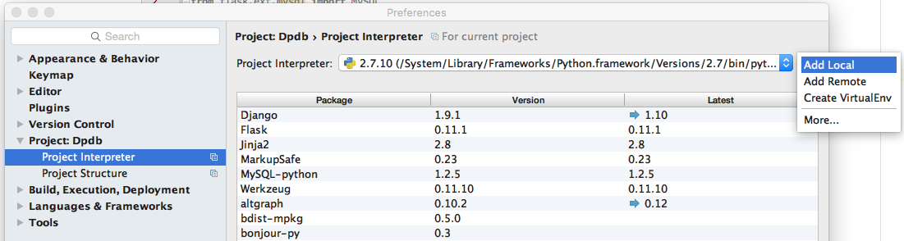
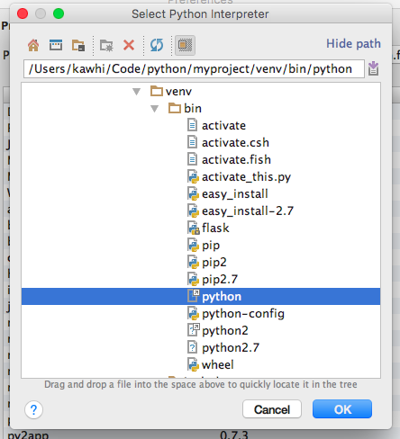
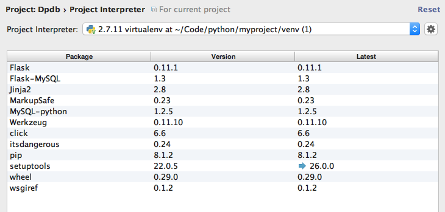
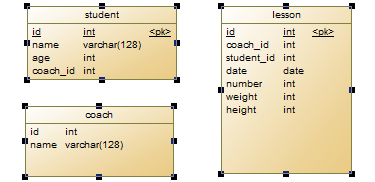

 *最底下可以对话哈哈哈！*

# Project Name: *Dpdb*

This is a small management system for dig-potency studio. We use [Flask](http://flask.pocoo.org/) which is a popular webdevelopment framework for Python. And this is the first project from Luo & Lyu.

Also, this is a gift for my friend Arrow. Hope this can make sense.

## Platform
1. Mac 10.11
2. Python 2.11
3. Flask 0.11
4. Mysql 5.7

## Installation
1. virtualenv, flask [Details](http://docs.jinkan.org/docs/flask/installation.html#virtualenv) 
	`sudo pip install virtualenv` 
	`mkdir myproject && cd myproject` 
	`virtualenv venv`  
	`sudo pip install flask`	
	
2. flask-mysql, pygal  
	`sudo pip install flask-mysql`
	`sudo pip install pygal`
	
3. pycharm [Download](https://www.jetbrains.com/pycharm/download/)  
	`from flaskext.mysql import MySQL` 时会有`unresolved reference`的**错误**。按以下步骤解决。
	- `command + ,` -> `Project Interpreter`  
	
	
	- 进入`Add local` 选择 `venv/bin/pyhon`  
	
	
	- 此时，可以在package里看到已安装的package  
	
	
	- 点击确认之后，可以看到 `import Mysql` 已成功。

4. mysql 与 MYSQLWorkbench [Download](http://dev.mysql.com/downloads/mysql/)
	- 进入Mysql Workbench.
	- File -> Open SQL Script -> Find ./Database_Design/rou.sql
	- Excute 

至此，配置基本结束。

## Database design (draft)

## Attention
1. Dpdb.py 中Mysql配置时的数据库名称、用户名要匹配。
2. 

## From Luo
Some details to be continue...

## From Lyu
This is from Lyu, my job is to get data from database and analysis the data and draw some graphs and export some data for user to ananlysis.

Some details to be continue...

> Lyu @ Luo:
	我们把自己的东西往里加吧？以这个为模板。感觉如何？ 
	2016.08.20

> Lyu @ Luo: 
    外面分别去完成homepagei.html 与 showResult.html 
	2016.08.22
	
> Lyu @ Luo: 
    我已经把画图和下拉基本功能实现了.  
    2016.08.26

